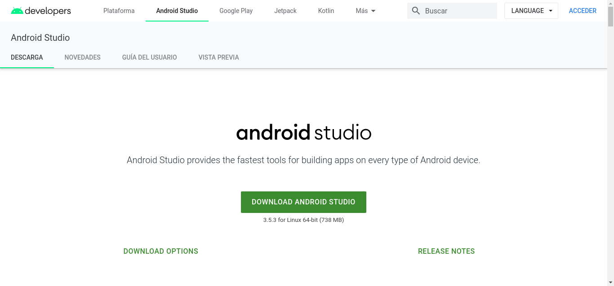
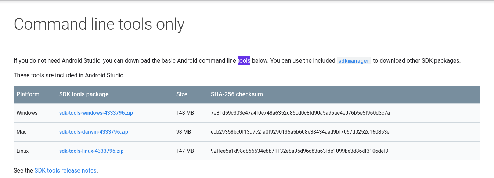
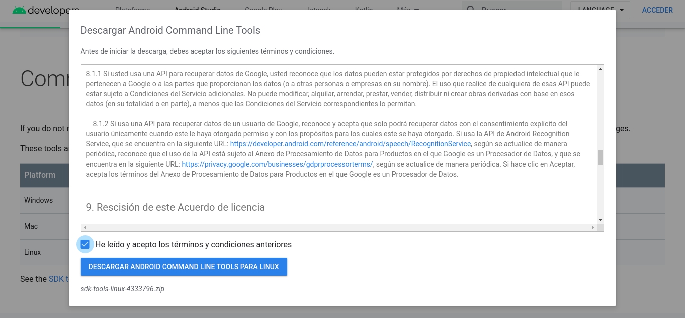
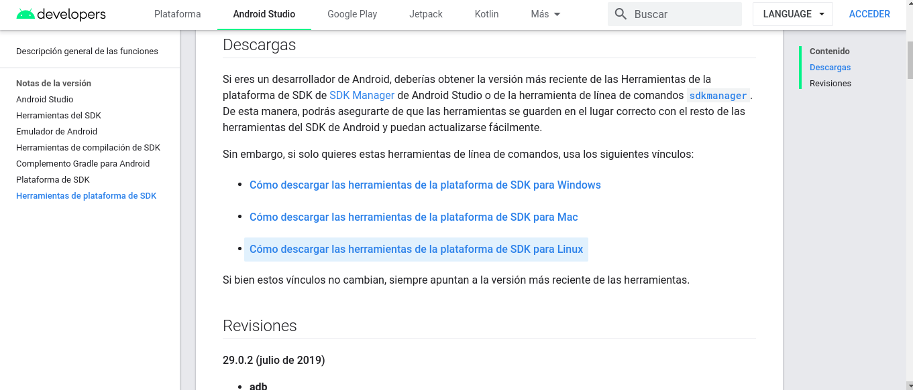
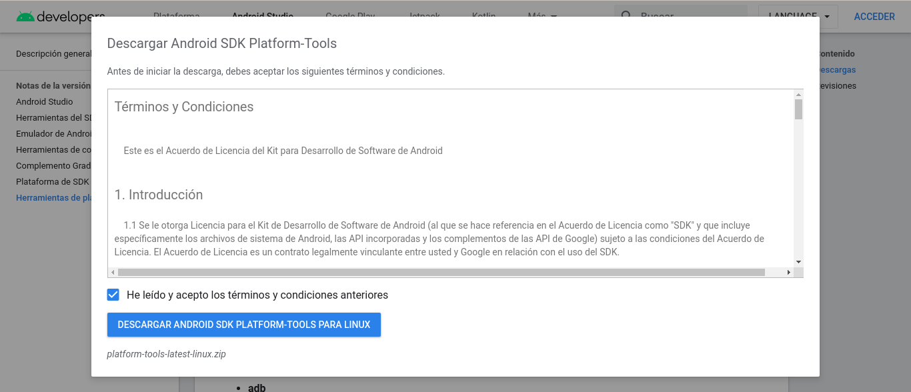

# Android Setup
This document contains the steps required to setup the Android platform.

##### Visit [Android Developers](https://developer.android.com/studio).


##### Download the Android SDK tools into this directory.


##### Accept the Terms of Services.


##### Download the Platform Tools from [this site](https://developer.android.com/studio/releases/platform-tools) into this directory.


##### Accept the Terms of Services.


##### Set the following env variables:
```bash
export ANDROID_SDK_ROOT="$(pwd)/android/tools"
export ANDROID_HOME="${ANDROID_SDK_ROOT}"
export ANDROID_AVD_HOME="$(pwd)/android/platform-tools"
export ANDROID_AAPT_HOME="$(pwd)/android/build-tools/29.0.0"
```

##### Install the following libraries.
```bash
${ANDROID_SDK_ROOT}/bin/sdkmanager "system-images;android-25;google_apis;x86"
${ANDROID_SDK_ROOT}/bin/sdkmanager "platforms;android-25"
${ANDROID_SDK_ROOT}/bin/sdkmanager "build-tools;29.0.0"
```

##### Accept all the licenses.
```bash
${ANDROID_SDK_ROOT}/bin/sdkmanager --licenses
```

##### Install the emulator.
```bash
${ANDROID_SDK_ROOT}/bin/sdkmanager --channel=3 emulator
```

##### Create a Virtual Device.
```bash
echo no | "${ANDROID_SDK_ROOT}/bin/avdmanager" \
            create avd \
            --force \
            --name "AppTimTest" \
            --abi "x86" \
            --package 'system-images;android-25;google_apis;x86'
```

##### Validate the AVD has been created
```bash
"${ANDROID_SDK_ROOT}/bin/avdmanager" list avd
```
```bash
Available Android Virtual Devices:
    Name: AppTimTest
    Path: /root/.android/avd/AppTimTest.avd
  Target: Google APIs (Google Inc.)
          Based on: Android 7.1.1 (Nougat) Tag/ABI: google_apis/x86
```

##### List all the emulator.
```bash
"${ANDROID_SDK_ROOT}/emulator" -list-avds
```
```bash
AppTimTest
```

##### Start the emulator.
```bash
"${ANDROID_SDK_ROOT}/emulator" -avd AppTimTest
```
```bash
```

##### Verify the list of attached devices.
Make sure you enable the USB debugging and on any of the attached devices.
```bash
"${ANDROID_AVD_HOME}/adb" devices
```
```bash
List of devices attached
2960f439050ea6eb	device
emulator-5554	    device
```
The first device is a physical device and the second one is an emulator.
