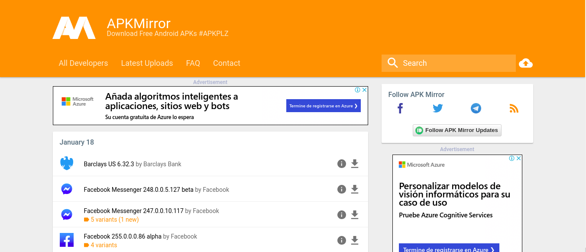
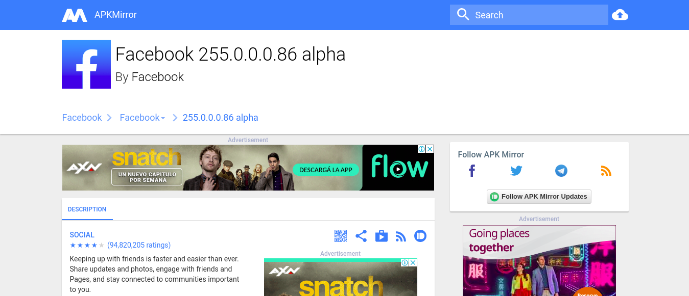
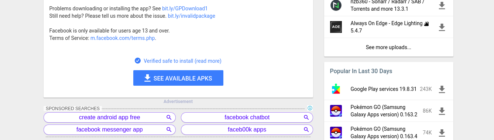
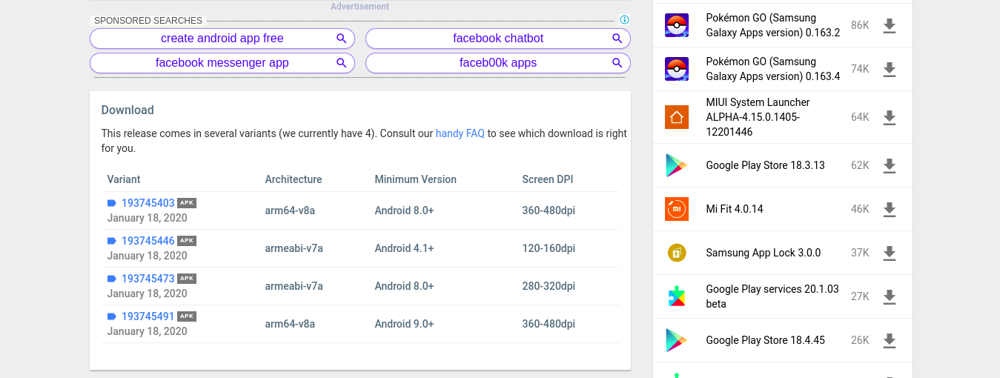
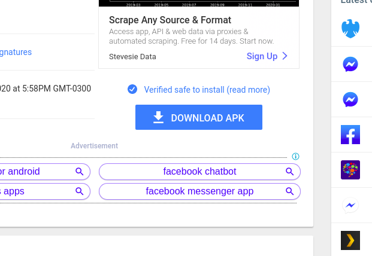

# APKs
This directory contains all APKs available by the app.
To make a new APK available in the app, follow these instructions.

## Instructions

##### Visit [this](https://www.apkmirror.com/) site and click on any of the applications available.

##### In this example, go to the [Facebook](https://www.apkmirror.com/apk/facebook-2/facebook/facebook-255-0-0-0-86-release/) download page.

##### Click on this button.

##### Click on any variant.

##### Complete the download step.

##### Finally, move the downloaded APK into this directory.
